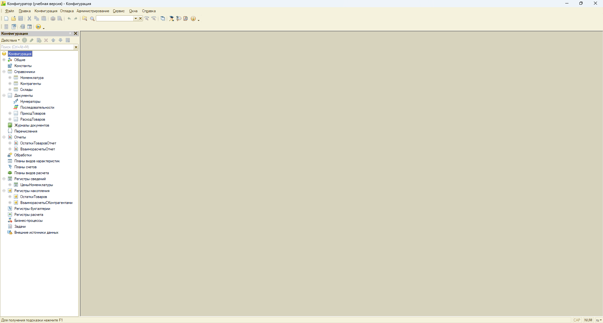
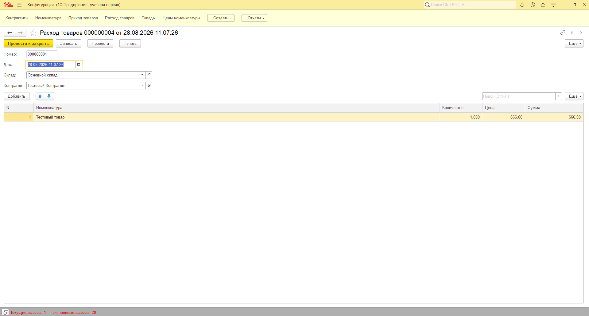
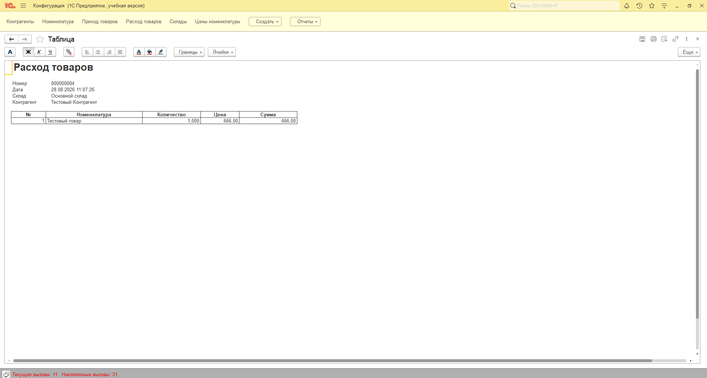
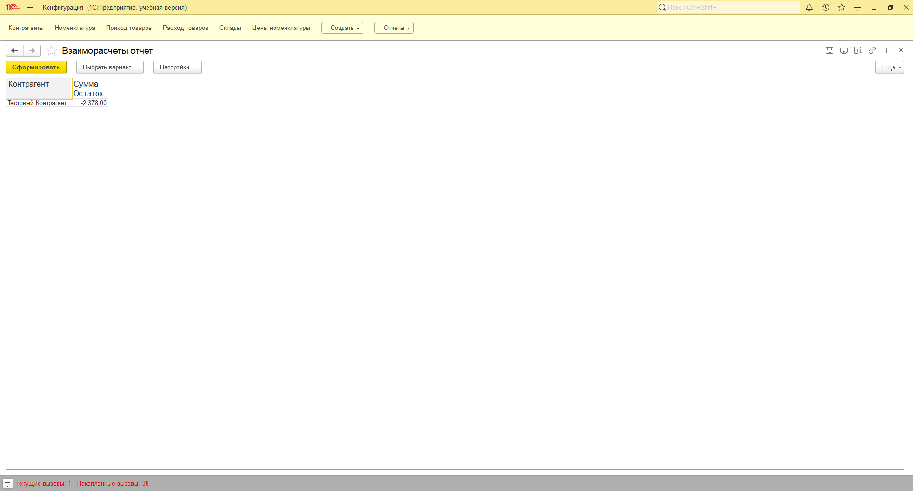

# Учёт склада — учебный пет-проект на 1С:Предприятие 8.3

Учебная конфигурация складского и взаиморасчётного учёта: приход/расход товаров, остатки по регистру накопления, взаиморасчёты с контрагентами, автоматическое ценообразование, отчёты на СКД, печатные формы, проверка достаточности остатков.

Разработано в рамках подготовки портфолио на позицию junior / стажёр 1С-программиста.

## Об авторе

**Кирилл Климов** — ищу позицию junior / стажёр 1С-программиста.

- Среднее специальное образование: «Разработчик веб и мультимедийных приложений» (ГАПОУ КК ЛСПК, 2024)
- Python изучал в рамках учёбы, дипломный проект — визуальная новелла на Python
- Второй диплом — учитель информатики
- Опыт работы с отчётностью и 1С в рознице (~2 года, администратор магазина)

Контакты: tg [@ne_kirill_klimov](https://t.me/ne_kirill_klimov) · email kkirill787@gmail.com

## Что реализовано

- Справочники: Контрагенты, Номенклатура, Склады
- Документы: Приход товаров, Расход товаров
- Регистр накопления остатков товаров
- Регистр учёта взаиморасчётов с контрагентами
- Отчёт «Взаиморасчёты» на системе компоновки данных (СКД)
- Печатная форма документа «Расход товаров»
- Автоматическое ценообразование по справочнику цен номенклатуры

## Скриншоты

**Дерево метаданных конфигурации**

**Форма документа «Расход товаров» с заполненными данными**

**Печатная форма документа**

**Отчёт «Взаиморасчёты» с результатом**

## Код

- [Модуль объекта документа «Расход товаров»](Ext/ObjectModule.bsl) — логика проведения документа: списание остатков, формирование движений по регистрам
- [Модуль менеджера документа «Расход товаров»](Ext/ManagerModule.bsl)

## Стек

1С:Предприятие 8.3, язык запросов 1С, СКД, конструктор печати, работа с динамическими списками
