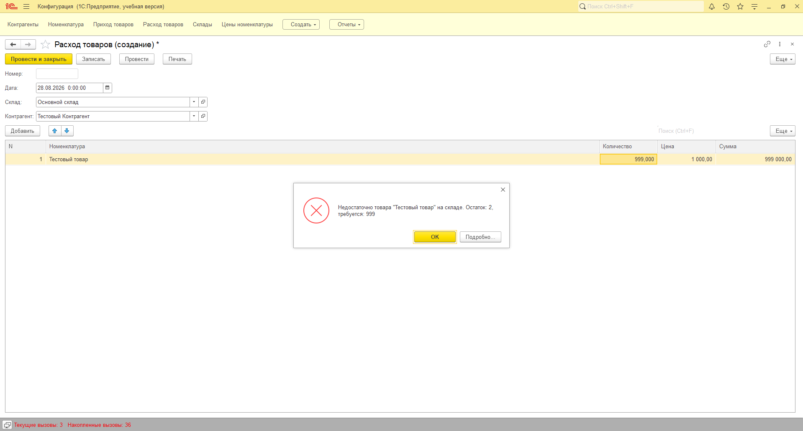
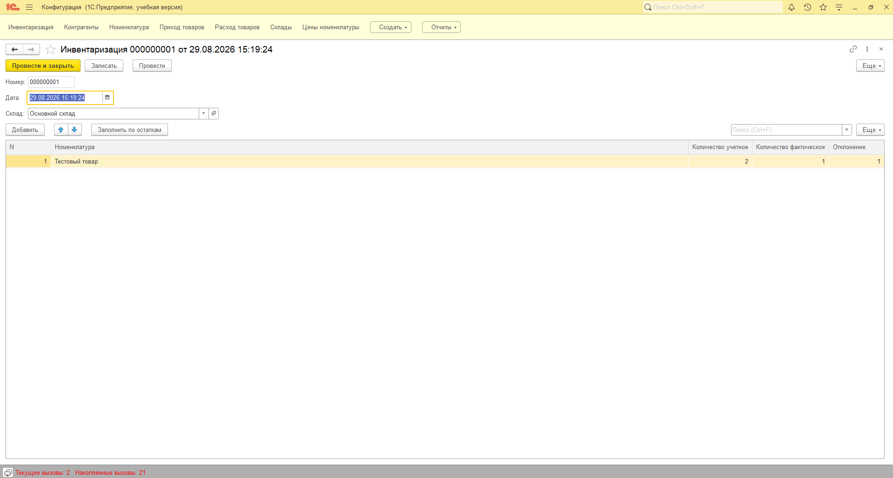

# Учёт склада — учебный пет-проект на 1С:Предприятие 8.3
Учебная конфигурация складского и взаиморасчётного учёта: приход/расход товаров, остатки по регистру накопления, взаиморасчёты с контрагентами, автоматическое ценообразование, инвентаризация с расчётом отклонений, отчёты на СКД, печатные формы, проверка достаточности остатков.
Разработано в рамках подготовки портфолио на позицию junior / стажёр 1С-программиста.
## Об авторе
**Кирилл Климов** — ищу позицию junior / стажёр 1С-программиста.
- Среднее специальное образование: «Разработчик веб и мультимедийных приложений» (ГАПОУ КК ЛСПК, 2024)
- Python изучал в рамках учёбы, дипломный проект — визуальная новелла на Python
- Второй диплом — учитель информатики
- Опыт работы с отчётностью и 1С в рознице (~2 года, администратор магазина)
Контакты: tg [@ne_kirill_klimov](https://t.me/ne_kirill_klimov) · email kkirill787@gmail.com
## Что реализовано
- Справочники: Контрагенты, Номенклатура, Склады
- Документы: Приход товаров, Расход товаров, Инвентаризация
- Регистр накопления остатков товаров
- Регистр учёта взаиморасчётов с контрагентами
- Отчёт «Взаиморасчёты» на системе компоновки данных (СКД)
- Печатная форма документа «Расход товаров»
- Автоматическое ценообразование по справочнику цен номенклатуры
- Проверка достаточности остатков при проведении документа «Расход товаров» — списание товара сверх остатка на складе блокируется с понятным сообщением пользователю
- Документ «Инвентаризация» — автозаполнение табличной части текущими остатками по складу, ручная корректировка фактического количества, автоматический расчёт отклонения и формирование корректирующих движений (приход при излишке, расход при недостаче)
## Скриншоты
**Дерево метаданных конфигурации**

**Форма документа «Расход товаров» с заполненными данными**

**Печатная форма документа**

**Отчёт «Взаиморасчёты» с результатом**

**Проверка достаточности остатков при проведении**

**Документ «Инвентаризация» с рассчитанным отклонением**

## Код
- [Модуль объекта документа «Расход товаров»](Ext/ObjectModule.bsl) — логика проведения документа: проверка достаточности остатков перед проведением, списание остатков, формирование движений по регистрам
- [Модуль менеджера документа «Расход товаров»](Ext/ManagerModule.bsl)
- [Модуль объекта документа «Инвентаризация»](Ext/Inventarizatsiya_ObjectModule.bsl) — расчёт отклонений и формирование корректирующих движений при проведении
- [Модуль формы документа «Инвентаризация»](Ext/Inventarizatsiya_FormModule.bsl) — серверная обработка кнопки «Заполнить по остаткам»
## Найденная и решённая проблема
При реализации кнопки «Заполнить по остаткам» столкнулся с ошибкой «Метод объекта не обнаружен» при вызове экспортного метода модуля объекта из формы — при том, что метод существовал и был корректно объявлен. Через отладчик и «Вычислить выражение» выяснил, что реквизит формы `Объект` в рантайме имел тип `ДанныеФормыСтруктура`, не поддерживающий вызов методов, вместо ожидаемого `ДанныеФормыОбъект`. Решение — явное преобразование через `РеквизитФормыВЗначение` перед вызовом метода и обратная запись через `ЗначениеВРеквизитФормы`.
## Стек
1С:Предприятие 8.3, язык запросов 1С, СКД, конструктор печати, работа с динамическими списками, отладка через встроенный отладчик Конфигуратора
